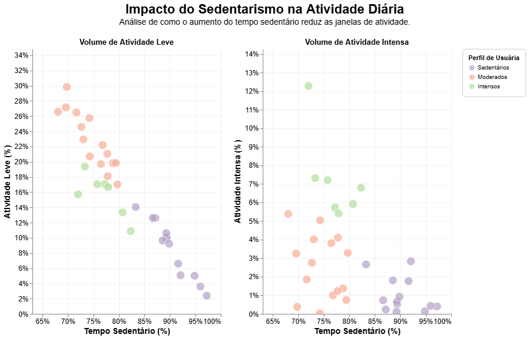
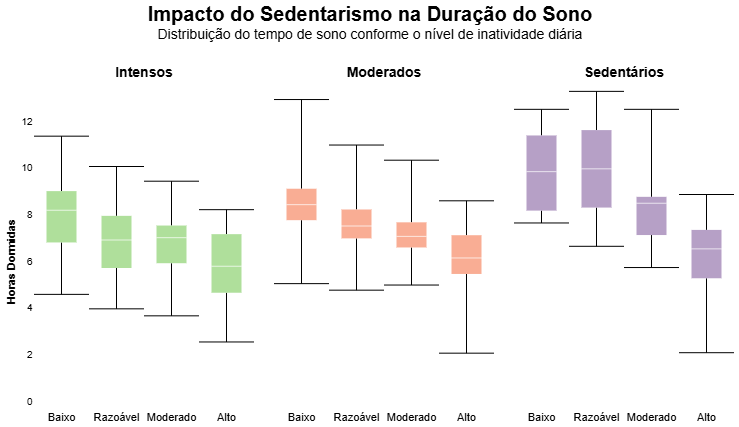
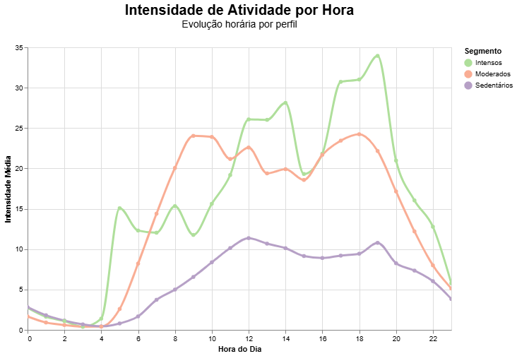
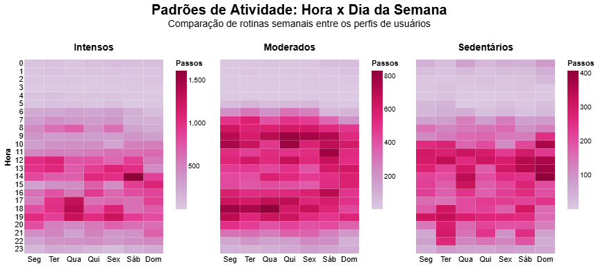

# 📈 Bellabeat Case Study: Análise de Dispositivos Inteligentes

## 📋 Sobre o Projeto
Este repositório contém o estudo de caso final do **Certificado Profissional de Análise de Dados do Google**. O objetivo é analisar dados de uso de dispositivos inteligentes (FitBit) para identificar tendências de consumo e fornecer recomendações estratégicas para a **Bellabeat**, uma empresa high-tech focada em produtos de saúde para mulheres.

---

## 🛠️ Tech Stack & Metodologia
Para este projeto, optei por uma abordagem de alta performance e visualização declarativa:
- **Linguagem:** Python
- **Manipulação de Dados:** `Polars` (Alternativa rápida ao Pandas para processamento eficiente).
- **Visualização:** `Altair` (Gráficos estatísticos e interativos).
- **Ambiente:** Jupyter Notebook / VS Code.

---

## 📉 Visão Geral (Big Numbers)

> **Usuários Analisados:** 35 | **Média de Passos:** 7.996 | **Horário de maior atividade:** 19h
> 
> **Média Tempo de Sono:** 7h | **Média Tempo Ativo:** 4h | **Média Tempo Sedentário:** 12h

---

## 🔍 Descobertas Principais

### 1. Segmentação de Personas
Não olhamos apenas para a média. Dividimos os usuários com base na intensidade de suas atividades diárias:

*   **Sedentários:** Alta proporção de minutos inativos.
*   **Moderados:** Predominância de atividades de intensidade leve.
*   **Intensos:** Foco em atividades de moderada a alta intensidade.

### 2. A Relação entre Atividade e Sono
Cruzamos os perfis com a **eficiência do sono**. A análise revelou que o tempo de inatividade é um preditor direto da qualidade do descanso: **Quanto menor o tempo sedentário, melhor a qualidade do sono em todos os grupos.**

### 3. Padrões de Horários e Intensidade
Mapeamos quando cada perfil está mais propenso a agir. Note os picos de intensidade:
- **Intensos:** 3 picos definidos (05-08h, 12-14h e 17-19h).
- **Moderados:** Atividade concentrada às 09h e 18h.
- **Sedentários:** Atividade constante, sem picos de esforço.

---

## ⚠️ Pontos de Atenção: Retenção e Engajamento
Identificamos uma "fricção de registro". Enquanto o monitoramento de passos é automático e estável, o registro de sono e peso sofre quedas drásticas.

| Tipo de Registro | Usuários Únicos | Frequência de Uso |
| :--- | :---: | :--- |
| **Atividade** | 35 | Alta / Estável |
| **Sono** | 24 | Oscilante / Baixa |
| **Peso** | 13 | Muito Baixa |

**Insight:** O uso cai significativamente aos **domingos e segundas-feiras**, indicando uma quebra de rotina no início da semana.

---

## 💡 Recomendações de Marketing

1.  **Gamificação de "Streaks":** Criar recompensas para registros de sono consecutivos para combater a inconstância.
2.  **Alertas de Intensidade:** Notificações push personalizadas nos horários de pico de cada perfil (ex: incentivo às 18h para o perfil Moderado).
3.  **Simplificação do Log:** Reduzir a necessidade de entrada manual para dados de peso e alimentação.
4.  **Campanhas de Fim de Semana:** Desafios de "Recarga de Domingo" para manter o engajamento nos dias de menor uso.

---

## 🚀 Como visualizar os códigos
O arquivo principal com toda a lógica de limpeza, transformação (Polars) e visualização (Altair) está disponível em: `notebooks/bellabeat_analysis.ipynb`.
